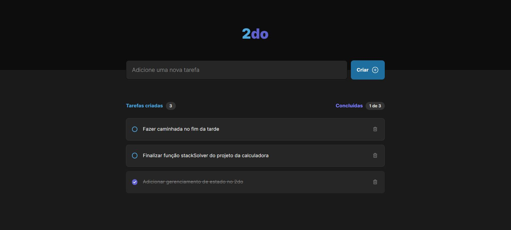

# 2do

## O que é isso?

2do é uma aplicação para listagem de tarefas que conta com um formulário para adicionar o título de uma tarefa e adicioná-la à lista. Após adicionadas, as tarefas ficam pendentes para serem marcadas como concluídas (por meio da checkbox à esquerda) ou excluídas (por meio da lixeira à direita). Tarefas podem ser excluídas estando concluídas ou não.

## Quero testar, como faço?

1. Faça o download/clone;
2. Acesse a pasta do projeto;
3. Execute o comando `npm i`;
4. Execute o comando `npm run dev`;
5. Acesse a aplicação pelo endereço que o Vite indicar.